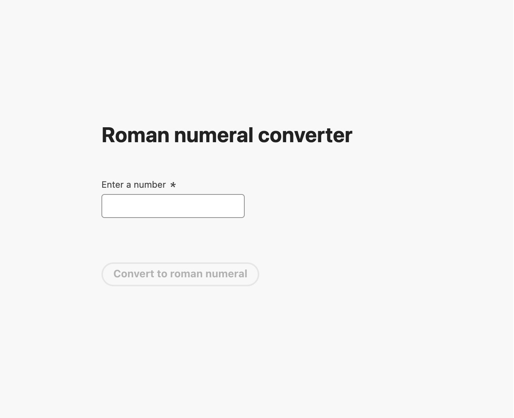
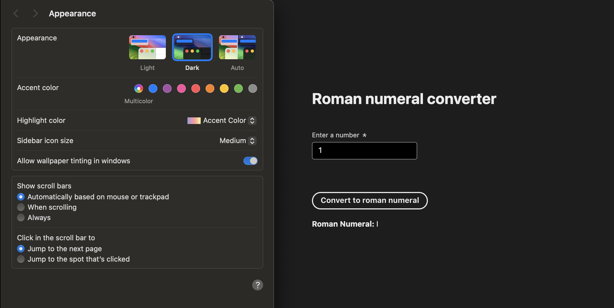
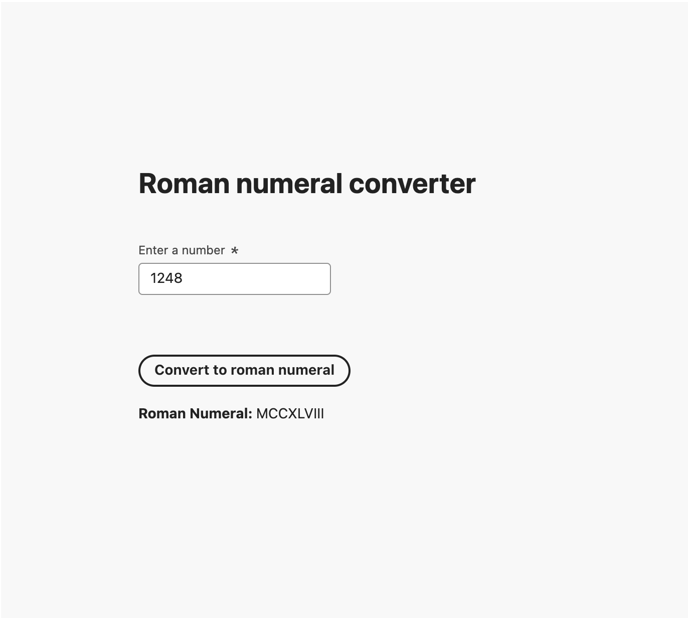
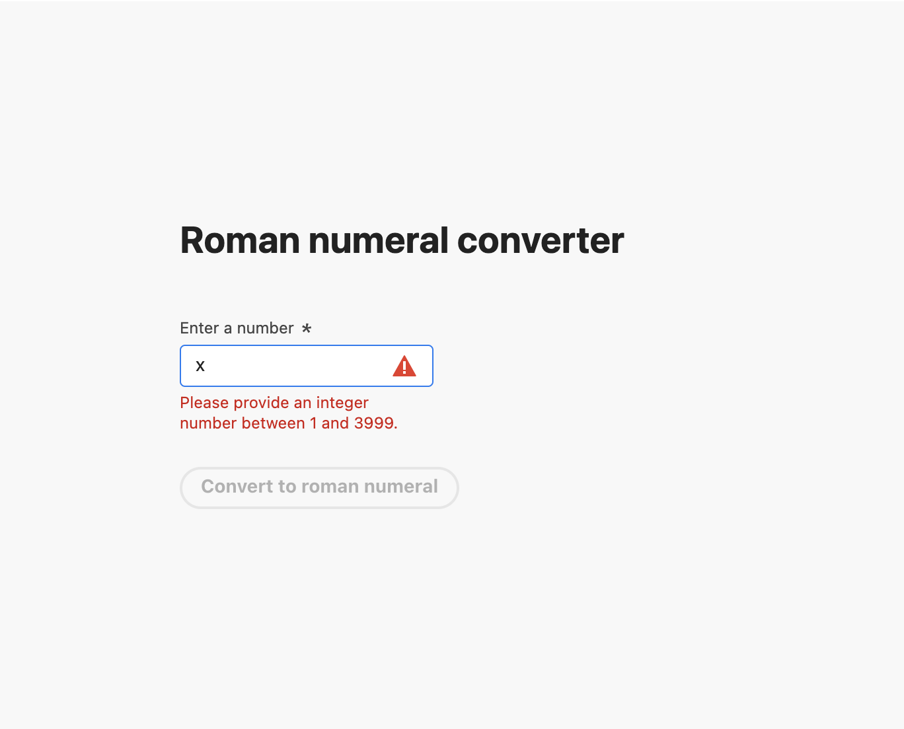
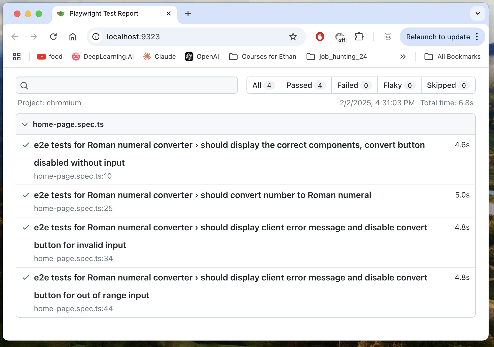
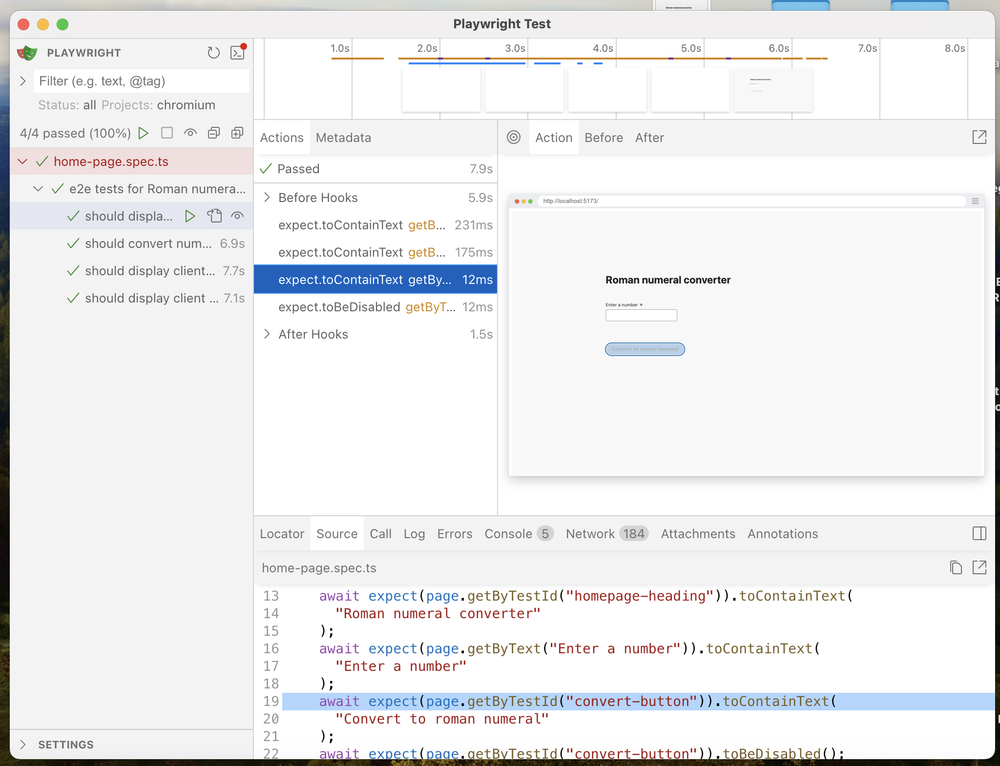

# Roman Numeral Converter
Welcome to the Roman Numeral Converter Project! This application will allows you to convert integers into Roman numerals through a user-friendly React frontend and a robust Express backend.

## Table of Contents

- [Project Overview](https://github.com/QingSongMSD/num2roman-web-service?tab=readme-ov-file#project-overview)
- [Getting Started](https://github.com/QingSongMSD/num2roman-web-service?tab=readme-ov-file#getting-started)
- [Usage](https://github.com/QingSongMSD/num2roman-web-service?tab=readme-ov-file#usage)
- [Test](https://github.com/QingSongMSD/num2roman-web-service?tab=readme-ov-file#test)
- [Project Structure](https://github.com/QingSongMSD/num2roman-web-service?tab=readme-ov-file#project-structure)
- [Engineering Methodology](https://github.com/QingSongMSD/num2roman-web-service?tab=readme-ov-file#engineering-methodology)
- [Dependency](https://github.com/QingSongMSD/num2roman-web-service?tab=readme-ov-file#dependency-attribution)

## Project Overview

This project consists of two main components: 
- **Backend** : Located in the `server` directory, built with TypeScript and Express. It provides an API endpoint to convert integers to Roman numerals.

- **Frontend** : Located in the `client/num_to_roman_client` directory, built with React and TypeScript. It offers a user interface to interact with the backend API.

## Getting Started

To setup the project on your local machine, follow these steps: 

1. **Clone the Repository**
```bash
mkdir <YourLocalDir>
cd <YourLocalDir>
git clone https://github.com/QingSongMSD/num2roman-web-service.git
cd num2roman-web-service
```

2. **Install Dependencies**

    **Ensure Node.js is Installed**
    ```bash
    # Verify the Node.js version:
    node -v
    # Verify npm version:
    npm -v 
    ```
    **Backend** 
    ```bash
    cd server
    npm install
    npm run build
    ```
    **Frontend**
    ```bash
    cd client/
    cd num_to_roman_client/
    npm install
    npm run build
    ```

3. **Run the Application**

    **Backend** 
    ```bash
    cd server
    npm run start
    ```
    You will get console message `Server running on port 8080`.

    **Frontend**
    ```bash
    cd client/
    cd num_to_roman_client/
    npm run preview
    ```
    Your will get message like
    ```bash
    VITE v6.0.11  ready in 352 ms
    ➜  Local:   http://localhost:4173/
    ➜  Network: use --host to expose
    ➜  press h + enter to show help
    ```

## **Usage**

Once both the backend and frontend are running: 

1. **Frontend** 

    1. Open your browser and navigate to http://localhost:4173/. 

    2. You will see the web app page. 
    
    
    3. The web app render in both light and dark mode depending on the system settings/preference. For example, at Mac OS switch your system/appearance `Dark` you will see the dark mode.
    

    4. Now enter a integer between 1 and 3999 to see its Roman numeral representation. 
    

    5. Enter an non-integer or an integer out of the range will get the error message. The convert button will be disabled when the input is invalid.
    

2. **Backend**

   1. You can also interact directly with the API by navigate to http://localhost:8080/romannumeral?query={integer}.
   Replace the `{integer}` with any integer value between 1 and 3999, the API will return a JSON response like this.
    ```bash
       {
        "input":"1248",
        "output":"MCCXLVIII"
        }
    ```

    2. Similar by enter an invalid input, you will get error.

## **Test**

To ensure the app works as expected, we've implemented unit and integration tests.

1. **Backend**
 - Unit Tests: Run using `Jest` to test individual functions in isolation. 
    ```bash
    cd server
    npm run test
    ```
 - Integration Tests: Run using `Jest` to test interactions between components with real HTTP calls.
    ```bash
    cd server
    npm run test:integration
    ```

2. **Frontend**
 - Unit Tests: Run use `Vitest` to test individual UI page.

 - Mock HTTP Tests: Run use `Vitest` with simulated HTTP responses to ensure they handle various scenarios correctly.
    ```bash
    # To run both
    cd client/
    cd num_to_roman_client/
    npm run test
    ```

3. **End-to-End** 
 - End-to-End (E2E) Tests: Run use `Playwright` to simulate real user interactions, testing the entire web app flow from the frontend to the backend.
    ```bash
    # Make sure to start your server
    cd server
    npm run start
    ```

    ```bash
    # Make sure to start your client
    cd client/
    cd num_to_roman_client/
    npm run preview
    ```

    ```bash
    # Run E2E test at client
    cd client/
    cd num_to_roman_client/
    npm run test:e2e
    ```
    You will get test result
    ```bash
    Running 4 tests using 4 workers
    4 passed (6.7s)
    ```
    To see your HTML test report
    ```bash
    npm run test:e2e:report
    ```
    You will get the test report like
    
    You could also open interactive UI Mode to re-run your E2E test and debug. More details follow [Playwright Doc](https://playwright.dev/).
    


## Project Structure

```bash
roman-numeral-converter/
├── client/num_to_roman_client
│   ├── src/
│   │   ├── pages/
│   │   │   ├── home-page.tsx
│   │   │   ├── home-page.spec.tsx
│   │   ├── App.tsx
│   │   ├── main.tsx
│   │   └── ...
│   ├── tests/
│   ├── e2e/
│   ├── index.html
│   ├── package.json
│   └── ...
└── server/
    ├── src/
    │   ├── routes/
    │   │   ├── romannumeral.ts
    │   ├── utils/
    │   │   ├── num_to_roman.ts
    │   ├── app.ts
    │   ├── index.ts
    │   └── ...
    ├── __tests__/
    │   ├── unit/
        │   ├── num_to_roman.test.ts
    │   ├── integration/
        │   ├── app.test.ts
    ├── package.json
    └── ...
```

## **Engineering Methodology**

Our approach emphasizes modularity and separation of concerns:

1. **Backend:**

    - Structure: Organized into routes and utils to promote scalability and maintainability.

    - Error Handling: Comprehensive error handling ensures that invalid inputs are managed gracefully, providing meaningful responses to the client.

2. **Frontend:**

    - Single Component Design: Since our application is a single page, we've streamlined the design to use just one HomePage component, reducing complexity.

    - Client-Side Validation: We've added checks on the user's input to catch errors before sending data to the server, which helps prevent unnecessary server requests.

## **Dependency Attribution** 

Selected the following dependencies to enhance development efficiency and application performance:

 1. **Backend:**

    [Express](https://expressjs.com/): A minimal and flexible Node.js web application framework for building web applications.

    [TypeScript](https://www.typescriptlang.org/): Adds static typing to JavaScript for improved code quality.

    [CORS](https://developer.mozilla.org/en-US/docs/Web/HTTP/CORS): Enables secure cross-origin requests between frontend and backend.

    [Jest](https://jestjs.io/): A simple framework for testing JavaScript code.

 2. **Frontend:**

    [Vite](https://vite.dev/guide/): Quick and light weight React project builder.

    [TypeScript](https://www.typescriptlang.org/)

    [Vitest](https://vitest.dev/): A Vite-native unit test framework. Fast and reuse Vite config.

    [Adobe React Spectrum](https://react-spectrum.adobe.com/): Recommended collection of React components that implement Adobe's design system, ensuring a consistent and accessible user experience.

    [Playwright](https://playwright.dev/): Reliable end-to-end testing for cross-browser modern web apps. It has rich API and develop-friendly testing and debugging features.
